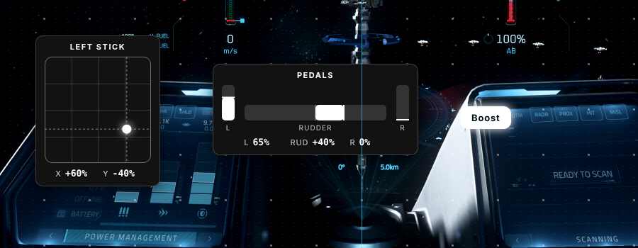

# Stay On Target

An OBS overlay for Star Citizen pilots. It shows your sticks, throttle, pedals and buttons live on stream and in recordings, so you can watch replays back and see exactly what your hands and feet were doing. It's a single HTML file with no install and no internet needed.

## Download

**[⬇ Download StayOnTarget.zip (latest version)](https://github.com/Adobe-Wan/stay-on-target/releases/latest/download/StayOnTarget.zip)**

1. Click the link above. Your browser saves `StayOnTarget.zip`.
2. Right-click the zip and choose **Extract All…** Put the folder somewhere permanent, for example `Documents\Stay On Target`. Don't run it from inside the zip or from your Downloads folder if you clean that out.
3. Follow **Set up in OBS** below.

Every version, with its change notes, is on the [Releases page](https://github.com/Adobe-Wan/stay-on-target/releases).

**Requirements:** Windows, a recent OBS Studio, and any joystick, throttle, pedals or button box that Windows sees as a game controller. Nothing else to install.

### Updating
Download the new zip and replace `StayOnTarget.html` in your folder. Keep your `profile.js`: your layout comes back automatically. You don't need to change anything in OBS.

## Set up in OBS
1. [Download](#download) and extract the zip. The folder holds `StayOnTarget.html`, the `Background Images for Edit Mode` sample screenshots, this README and the license. Keep them together.
2. In OBS, add a **Browser** source, tick **Local file** and pick `StayOnTarget.html`.
   - **Width / Height:** use your OBS canvas size (Settings → Video → Base Canvas, usually **1920 × 1080**). The overlay then maps 1:1 to your screen, and you position widgets by dragging them in step 4 rather than by moving the source.
   - **FPS:** tick custom frame rate and set **60**.
3. Right-click the source and choose **Interact**. The first time, Stay On Target opens in edit mode with a **Getting Started** dialog. Move a stick so the browser sees your controllers. (Later, press **E** or click **Open the Editor** to return.)
4. Click **Get Started**. A dialog in the middle of the screen walks you through it:
   1. **Choose a Background:** pick the sample screenshot that matches your screen, or **Load My Own Screenshot**. It shows only while editing, so you can place widgets around the in-game HUD instead of on top of it.
   2. **What Are You Adding?** Stick, Pedals, Button, Throttle, Single Axis or Label.
   3. **Move it** when asked. It detects the axis and its direction.
   4. **Name It**, then **Add to Overlay**. Press **Add More** for the next device.

   New widgets line up along the bottom middle of the screen, where most streamers keep their inputs. The round **+** button (bottom right, or press **A**) adds more at any time.
5. Drag the widgets where you want them (see *Positioning* below). Click one to change its name, size or colors.
6. Switch **Edit Mode** off in the top bar (or press **E**). The screenshot background disappears with the editor.
7. **Save / Share → Download profile.js**, and save it in the same folder as `StayOnTarget.html`. This keeps the setup safe if OBS clears its cache.

## Opening it in a normal browser
Outside OBS the page shows a dark preview background with a note that it's transparent in OBS. In OBS it stays fully transparent. If another streaming app shows the dark background, add `?transparent` to the end of the file URL.

## 4K and other resolutions
Layouts are designed on a 1920×1080 canvas and **fit to the screen size** automatically, so a layout made at 1080p looks the same at 1440p or 4K, and the whole layout always fits in a shorter browser window or on an ultrawide. The editor's text scales up too. If a widget ever ends up outside the window, the editor home panel offers **Bring Into View**. Both can be changed in **Settings → Size** (*Fit overlay to screen size*, *Editor text size*).

**Moving a layout between screens.** Each profile remembers the screen shape it was arranged on. Open it on a different shape (a 4K browser tab with toolbars, a 1080p OBS source, an ultrawide) and each group of widgets keeps its place: things along the bottom middle stay at the bottom middle, and a widget near an edge or corner keeps its distance from it. Nothing is overwritten until you edit, so going back to the original screen puts everything exactly where it was. Profiles from v1.1 and earlier record their screen the next time you change something or download profile.js.

## Positioning
- **Background screenshot.** The editor shows a Star Citizen screenshot behind your widgets so you can place them around the HUD. It only shows in the editor, never on stream. It's step 1 of setup, and you can change it any time on the editor home panel (**Load My Own Screenshot**, **No Background**).
- **Center lines** (blue) mark the middle of the screen. While dragging, **smart guides** (pink) snap a widget's edges or center to the screen center, edges, safe margin and other widgets. When nothing is close, it snaps to the **grid**. Hold **Alt** to drag freely.
- **Select several:** drag a box on empty space, or Shift+click widgets. Ctrl+A selects all. Drag any selected widget to move them together.
- **Align and place:** with a selection, use the panel's align buttons (left, center, right, top, middle, bottom). *Snap to Center*, *Center Horizontally*, *Bottom Center* and *Snap to Bottom* move the selection as one block.
- **Spacing:** with 2+ selected, type a **Gap between, px** (for example 16) and press **Space Evenly ↔** or **↕** to set them exactly that far apart. Leave the gap on *Auto* to spread 3+ widgets evenly across their current width or height.
- **Nudge** with the arrow keys (Shift = 10px). **Tab** hides the side panel so you can see the whole screen.
- Grid size, safe margin, and turning guides or the grid off are in **Settings**.

## Sample backgrounds
Sample screenshots live in the `Background Images for Edit Mode` folder next to `StayOnTarget.html`. The download includes 16:9 and 21:9 ultrawide samples. The editor uses whichever sample best matches your screen shape, as long as the files keep these exact names:

| File | Screen shape |
|---|---|
| `16by9.jpg` | 1920×1080, 2560×1440, 3840×2160 |
| `21by9.jpg` | 3440×1440 ultrawide |
| `32by9.jpg` | 5120×1440 super-ultrawide |

Drop a new one into the folder and it appears in the editor on the next load. Keep the folder with the HTML when you share the app.

## Widget layout
Select a widget (or several). **Size** sits at the top of the side panel: drag the slider or type an exact percentage (50 to 250%) in the box next to it. With several widgets selected, the value you type applies to all of them.

Buttons and pedals also get **Width scale** and **Height scale** (25 to 400%, slider or typed), which stretch the box on one axis without changing the text size. A very narrow button cuts off its label. **Reset Layout** puts both back to 100%.

Then use **Layout**:
- **Padding** and **Corner radius**. The stick's inner box uses the same corner radius as the widget, so the corners match.
- **Show name**, **Show values (%)** and **Show axis labels** switch those parts on or off. On pedals with axis labels off, the rudder value is anchored to the widget's center: 0% sits dead center, right rudder grows the number to the right and left rudder grows it to the left, with the brake values under their bars.
- **3D depth** (0 to 100%) gives the panel a beveled, raised edge, sinks the stick gate into the panel, and turns the stick's ball into a lit sphere with a shadow. It's drawn once with CSS shadows and gradients, so it adds no per-frame cost in OBS.
- **Inner sizes:** stick area for sticks (always a square 4×4 gate before any perspective), bar width and height for throttles and single axes, and rudder and brake bar width and height for pedals. These are in pixels before the **Size** slider, which still scales the whole widget.
- **Reset Layout** puts them back to the defaults.

Widgets keep a fixed size while you fly. The % values reserve room for their widest reading, so moving a stick never resizes anything.

## Color themes
Match your widgets to your ship's MFDs. Select widgets and look under **Color Theme** in the side panel, or use the same controls in **Settings** to color every widget (new widgets then use it too).
- **Default** (neutral white on a fully opaque charcoal background, what new widgets start with) and **AVS** (Avenger Squadron: white, blue and black) are tiles at the top.
- **Ship manufacturer** is a dropdown with a color swatch on every row: Aegis Dynamics, Drake Interplanetary, Anvil Aerospace, Esperia, Crusader Industries, Origin Jumpworks, MISC, Roberts Space Industries, GATAC Manufacture, Mirai, Banu Souli, ARGO Astronautics, AopoA and Greycat Industrial. Use the arrow keys or type a letter to jump.

Each theme sets the primary color for text and borders, the accent for the live stick dot, bars and pressed buttons, and a dark background. You can still fine-tune Highlight, Text, Border and Background by hand underneath. Click a color to open the picker: drag in the square for saturation and brightness (or use the arrow keys, Shift for bigger steps), drag the rainbow bar for hue, type a hex code, click a preset, or use **Pick** to grab a color from anywhere on screen (where the browser supports it). Escape or a click outside closes it.

## Perspective (2.5D HUD look)
Select a widget (or several) and use **Perspective** in the side panel to tilt it onto an angled cockpit screen.
- **Presets:** Flat, Left HUD Panel, Right HUD Panel, Lower Console, Upper Canopy.
- **Sliders:** Tilt (forward/back), Turn (left/right), Rotate, Skew horizontal and vertical, and Depth (lower values give a stronger 3D effect).
- **Reset to Flat** undoes it.
- Snapping and alignment use the widget's flat footprint, so the tilted corners can sit slightly outside the guides.

Perspective is a single CSS 3D transform per widget, which the GPU composites. It costs nothing per frame, and flat widgets skip it entirely.

## Performance in OBS
- Widgets only redraw when an input actually changes. Hands off the controls means near-zero drawing work.
- Keep **Enable Browser Source Hardware Acceleration** on (OBS Settings, Advanced). That's the default.
- Set the Browser Source FPS to 60. Going higher only adds load.

## Keys (in edit mode or OBS Interact)
| Key | Action |
|---|---|
| E, double-click, or the Edit Mode switch | Open / close the editor |
| A | Open the round + menu (add a device, button or label) |
| H | Show / hide the session heatmap |
| R | Reset the session heatmap |
| Delete | Remove the selected widgets |
| Arrows / Shift+arrows | Nudge 1px / 10px |
| Ctrl+A / Ctrl+D | Select all / duplicate |
| Tab | Hide / show the side panel |
| Alt (while dragging) | Turn snapping off |

## Session heatmap
Stay On Target quietly records where every stick, throttle and pedal spends its time. Press **H** to see it, for example which way you strafe most this session. Press **R** to start fresh.

## Two identical sticks (e.g. 2× VIRPIL Alpha Prime)
They report the same hardware name, so Stay On Target tells them apart by connection order, which Windows normally keeps stable. If left and right ever come up reversed, click either stick widget and press **Swap With Identical Device**.
For a permanent fix, give one stick a different USB Product ID in VPC Configurator, then re-add that stick.

## Starting over
**Reset All** (next to **Import Profile** on the editor's home panel) asks for confirmation, then removes every widget and returns all settings, colors and the edit-mode background to their defaults. It can't be undone, so use **Save / Share** first if you might want the layout back.

## A device isn't showing up
Open the editor and click **Check Devices** on the home panel. It lists every controller your browser is passing to Stay On Target, live, and which widgets are still waiting for theirs.
- **Wake it up.** Browsers hide controllers until you use them after the page opens. Pedals have no buttons, so push a pedal or a toe brake all the way once.
- **Four controllers at most.** Browsers and OBS show no more than 4 game controllers at a time. If all 4 slots are taken, a fifth device (often the pedals) gets left out. Unplug or disable what you don't need on stream: a spare throttle, a wheel, an Xbox pad, or virtual controllers from Steam, vJoy or similar tools. Win+R, `joy.cpl` lists everything Windows sees.
- **Different browsers.** A layout made in OBS also works in Chrome, Edge or Firefox; devices are matched by their USB ids.
- **Remap a widget.** Select it and click **Detect Device** under *Device*. You move the stick or pedals (or press the button) again, and the widget switches to whatever you used, keeping its name, place, size and colors.
- Still missing? Close other apps that read controllers, unplug the device and plug it back in, then refresh.

## Sharing with a trainee
Send `StayOnTarget.html` and your `profile.js`. With the same hardware it just works. With different hardware they remove the widgets and use **+ Device** for their own.

## License and credits
- **License:** MIT (see `LICENSE`). Anyone can use, share and modify Stay On Target for free, as long as the license notice stays with it.
- **Third-party code:** none. Stay On Target uses no libraries, frameworks, web fonts, analytics or online services. It's one HTML file using built-in browser features (Gamepad API, Canvas, CSS), and text uses the fonts already on the viewer's computer. Nothing is downloaded and nothing about you or your inputs leaves your PC.
- **Design:** the editor follows Material Design (MUI) layout and accessibility conventions, re-created in plain CSS. No MUI code is included.
- **Color themes:** fan-made approximations of in-game MFD colors. They're not official assets.
- **Sample screenshots:** captured from Star Citizen. Game imagery belongs to Cloud Imperium.

This is an unofficial Star Citizen fan project, not affiliated with the Cloud Imperium group of companies. Star Citizen®, Roberts Space Industries® and Cloud Imperium® are trademarks of Cloud Imperium Rights LLC. Ship manufacturer names are used only to describe color themes.
